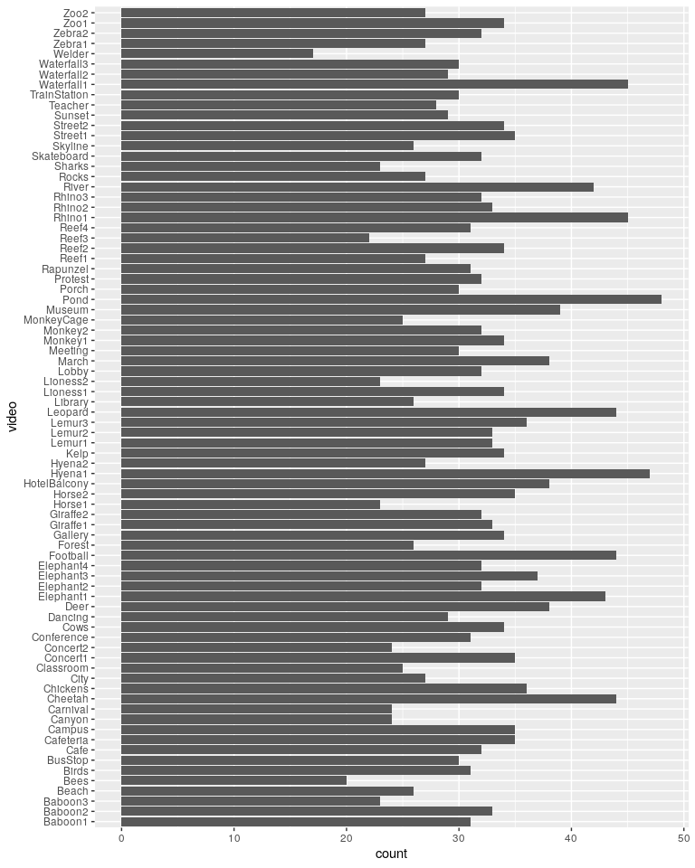
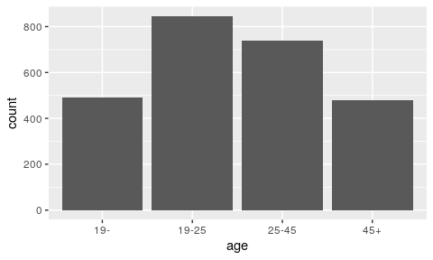
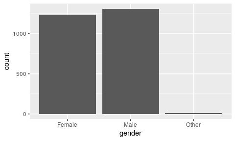
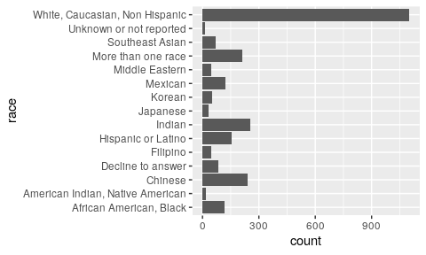
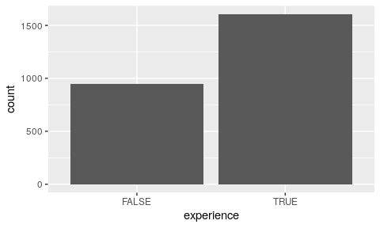
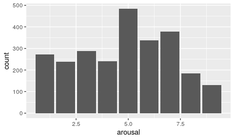
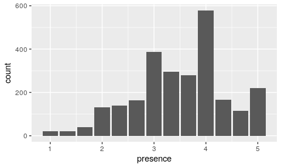
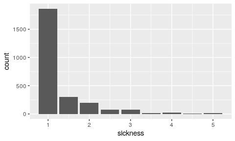
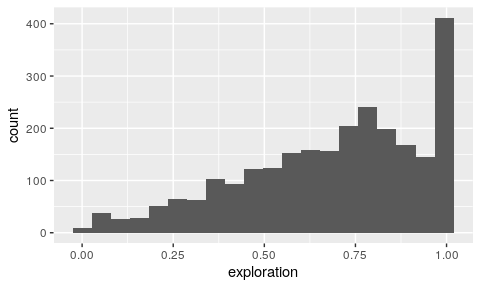

Stimulus Sampling 360 Dataset
================

# Files

CSV of data:
<https://github.com/vhilab/psych-360/blob/master/psych-360.csv>

Video Files: <https://vhil.stanford.edu/mm/psych-360-videos.zip>

# CSV File Information

Each row represents a sample, which in this case is a participant
watching a video. Each participant watched five videos, so each
participant has five rows associated with it.

  - [`location`](#identification-location-pid-and-order): Locations of
    the study. Lab 1 and Lab2 are the rooms of our lab and Museum is our
    booth at The Tech Interactive in San Jose.
  - [`pid`](#identification-location-pid-and-order): The IDs of the
    participants. They are unique per location not across locations.
  - [`video`](#video): The video the participants watched.
  - [`order`](#identification-location-pid-and-order): The order of the
    video from the participant’s perspective.
  - [`age`](#age): The age of the participant. (19-/19-25/26-45/45+)
  - [`gender`](#gender): The gender of the participant.
    (Female/Male/Other)
  - [`race`](#race): The race of the participant.
  - [`experience`](#experience): Whether the participant had prior VR
    experience.
  - [`arousal`](#arousal): The arousal level the participant reported
    after watching the video.
  - [`presence`](#presence): The presence level the participant reported
    after watching the video.
  - [`sickness`](#sickness): The simulator sickess level the participant
    reported after watching the video.
  - [`preference`](#preference): The preference level the participant
    reported after watching the video.
  - [`exploration`](#exploration): The proportion of a full 360-degree
    horizontal sweep participant made watching the video

The first ten results are show
below.

| location | pid | video      | order | age   | gender | race                           | experience | arousal | presence | sickness | preference | exploration |
| :------- | --: | :--------- | ----: | :---- | :----- | :----------------------------- | :--------- | ------: | -------: | -------: | ---------: | ----------: |
| Lab1     |   5 | Pond       |     1 | 19-25 | Male   | White, Caucasian, Non Hispanic | TRUE       |       2 | 2.666667 |      1.0 |        2.5 |   0.8944242 |
| Lab1     |   5 | Baboon1    |     2 | 19-25 | Male   | White, Caucasian, Non Hispanic | TRUE       |       5 | 3.666667 |      1.0 |        5.0 |   0.4832044 |
| Lab1     |   5 | Concert1   |     3 | 19-25 | Male   | White, Caucasian, Non Hispanic | TRUE       |       3 | 2.000000 |      1.0 |        1.5 |   0.4845384 |
| Lab1     |   5 | Rapunzel   |     4 | 19-25 | Male   | White, Caucasian, Non Hispanic | TRUE       |       5 | 3.000000 |      1.0 |        1.0 |   0.4024281 |
| Lab1     |   5 | Chickens   |     5 | 19-25 | Male   | White, Caucasian, Non Hispanic | TRUE       |       3 | 3.000000 |      1.0 |        2.0 |   1.0000000 |
| Lab1     |   6 | Waterfall3 |     1 | 19-25 | Female | Chinese                        | TRUE       |       5 | 3.666667 |      1.0 |        3.5 |   0.9329999 |
| Lab1     |   6 | Rocks      |     2 | 19-25 | Female | Chinese                        | TRUE       |       3 | 3.333333 |      1.0 |        3.0 |   0.8228508 |
| Lab1     |   6 | Forest     |     3 | 19-25 | Female | Chinese                        | TRUE       |       5 | 4.000000 |      1.5 |        1.5 |   0.7769808 |
| Lab1     |   6 | Bees       |     4 | 19-25 | Female | Chinese                        | TRUE       |       7 | 3.666667 |      1.0 |        4.5 |   0.5573311 |
| Lab1     |   6 | March      |     5 | 19-25 | Female | Chinese                        | TRUE       |       7 | 4.000000 |      1.5 |        2.5 |   1.0000000 |

Each variable is shown descriptively and explored further below.

## Identification (Location, PID, and Order)

Note that the unique identifier for a participant is the pair of
variables (location,
pid).

``` r
# When grouping by PID only, how many PIDs have more than 5 rows associated with them?
psych_360 %>% 
  group_by(pid) %>%
  count() %>%
  filter(n != 5) %>%
  nrow
```

    ## [1] 59

``` r
# Instead, it's better to group by PID and Location if you want participants to be uniquely grouped
psych_360 %>%
  group_by(pid, location) %>%
  count() %>%
  filter(n != 5) %>%
  nrow()
```

    ## [1] 0

## Video

<!-- -->

## Age

<!-- -->

## Gender

<!-- -->

## Race

<!-- -->

## Experience

<!-- -->

## Arousal

<!-- -->

## Presence

<!-- -->

## Sickness

<!-- -->

## Preference

<!-- -->

## Exploration

<!-- -->
